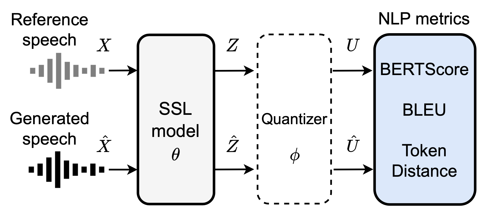

# DiscreteSpeechMetrics

Reference-aware automatic evaluation of speech generation using discrete speech representations.

<div align="center">

</div>

>**Abstract:**<br>
While subjective assessments have been the gold standard for evaluating speech generation, objective measures such as Mel Cepstral Distortion (MCD) and Mean Opinion Score (MOS) prediction models have also been used. Due to their cost efficiency, there is a need to establish objective measures that are highly correlated with human subjective judgments. This paper proposes reference-aware automatic evaluation methods for speech generation inspired by text generation metrics. The proposed *SpeechBERTScore* calculates the BERTScore for self-supervised speech feature sequences obtained from the generated speech and reference speech. We also propose to use self-supervised discrete speech tokens to compute objective measures such as *SpeechBLEU*. The experimental evaluations on synthesized speech show that our method correlates better with human subjective ratings than MCD and a state-of-the-art MOS prediction model. Furthermore, our method is found to be effective for noisy speech and has cross-lingual applicability.

## Installation

To use `discrete-speech-metrics`, you can install the latest version directly from GitHub:

```bash
pip3 install git+https://github.com/Takaaki-Saeki/discrete-speech-metrics.git
```


## Usage

In the current DiscreteSpeechMetrics, we provide three types of new metrics: *SpeechBERTScore*, *SpeechBLEU* and *SpeechTokenDistance*.
According to the evaluation results in the paper, the following SpeechBERTScore shows the highest correlation with human subjective judgements.

### SpeechBERTScore

SpeechBERTScore calculates BERTScore on dense self-supervised speech features of generated and reference speech.
The usage of the best setting in the paper is as follows.

```python
import numpy as np
from discrete_speech_metrics import SpeechBERTScore

# Reference and generated waveforms.
ref_wav = np.random.rand(10009)
gen_wav = np.random.rand(10003)

metrics = SpeechBERTScore(
    sr=16000,
    model_type="wavlm-large",
    layer=14,
    use_gpu=True)
precision, _, _ = metrics.score(ref_wav, gen_wav)
# precision: 0.957
```

### SpeechBLEU

SpeechBLEU calculates BLEU on speech discrete tokens of generated and reference speech.
The usage of the best setting in the paper is as follows.

```python
import numpy as np
from discrete_speech_metrics import SpeechBLEU

# Reference and generated waveforms.
ref_wav = np.random.rand(10009)
gen_wav = np.random.rand(10003)

metrics = SpeechBLEU(
    sr=16000,
    model_type="hubert-base",
    vocab=200,
    layer=11,
    n_ngram=2,
    remove_repetition=True,
    use_gpu=True)
bleu = metrics.score(ref_wav, gen_wav)
# bleu: 0.148
```

### SpeechTokenDistance

SpeechTokenDistance calculates character-level distance measures on speech discrete tokens of generated and reference speech.
The usage of the best setting in the paper is as follows.

```python
import numpy as np
from discrete_speech_metrics import SpeechTokenDistance

# Reference and generated waveforms.
ref_wav = np.random.rand(10009)
gen_wav = np.random.rand(10003)

metrics = SpeechTokenDistance(
    sr=16000,
    model_type="hubert-base",
    vocab=200,
    layer=6,
    distance_type="jaro-winkler",
    remove_repetition=False,
    use_gpu=True)
distance = metrics.score(ref_wav, gen_wav)
# distance: 0.548
```

## Other supported metrics

### Mel Cepstral Distortion (MCD)
MCD is a common metric for speech synthesis, which indicates how different two mel cepstral dequences are.
Dynamic time warping is used to align the generated and reference speech features with different sequential lengths.

```python
from discrete_speech_metrics import MCD

# Reference and generated waveforms.
ref_wav = np.random.rand(10009)
gen_wav = np.random.rand(10003)

metrics = MCD(sr=16000)
mcd = metrics.score(ref_wav, gen_wav)
# mcd: 0.724
```

### Log F0 RMSE
Log F0 RMSE is a common metric to evaluate the prosody of synthetic speech, which calculates the differece of log F0 sequences from generated and reference speech.
Dynamic time warping is used to align the generated and reference speech features with different sequential lengths.

```python
from discrete_speech_metrics import LogF0RMSE

# Reference and generated waveforms.
ref_wav = np.random.rand(10009)
gen_wav = np.random.rand(10003)

metrics = LogF0RMSE(sr=16000)
logf0rmse = metrics.score(ref_wav, gen_wav)
# logf0rmse: 0.305
```

### PESQ
PESQ is a reference-aware objective metric to evaluate the perceptual speech quality.
It assumes the generated and reference speech signals are time-aligned.

```python
from discrete_speech_metrics import PESQ

# Reference and generated waveforms.
ref_wav = np.random.rand(10000)
gen_wav = np.random.rand(10000)

metrics = PESQ(sr=16000)
pesq = metrics.score(ref_wav, gen_wav)
# pesq: 2.12
```

### UTMOS
[UTMOS](https://arxiv.org/abs/2204.02152) is an automatic mean opinion score (MOS) prediction model that predicts subjective MOS from the generated speech.
It does not require reference speech samples.

```python
from discrete_speech_metrics import UTMOS

# Generated waveforms.
gen_wav = np.random.rand(10003)

metrics = UTMOS(sr=16000)
utmos = metrics.score(generated_wav)
# utmos: 3.13
```

## Citation
Comming soon.